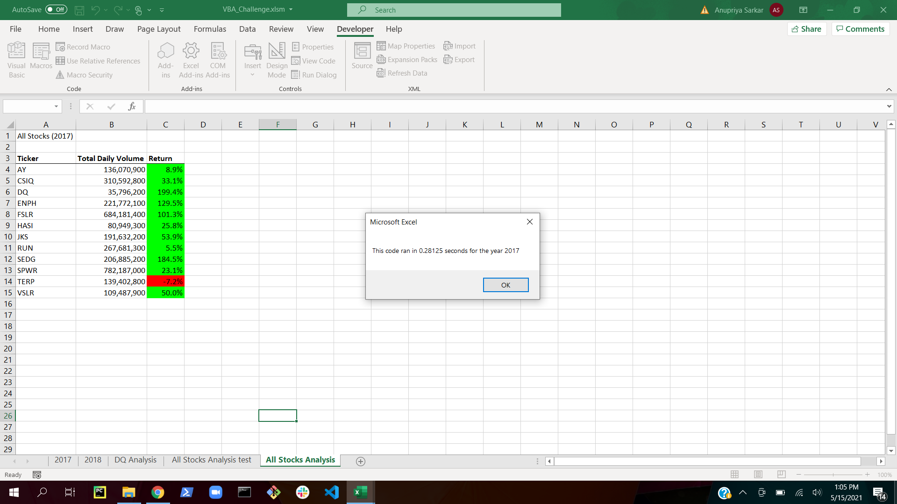
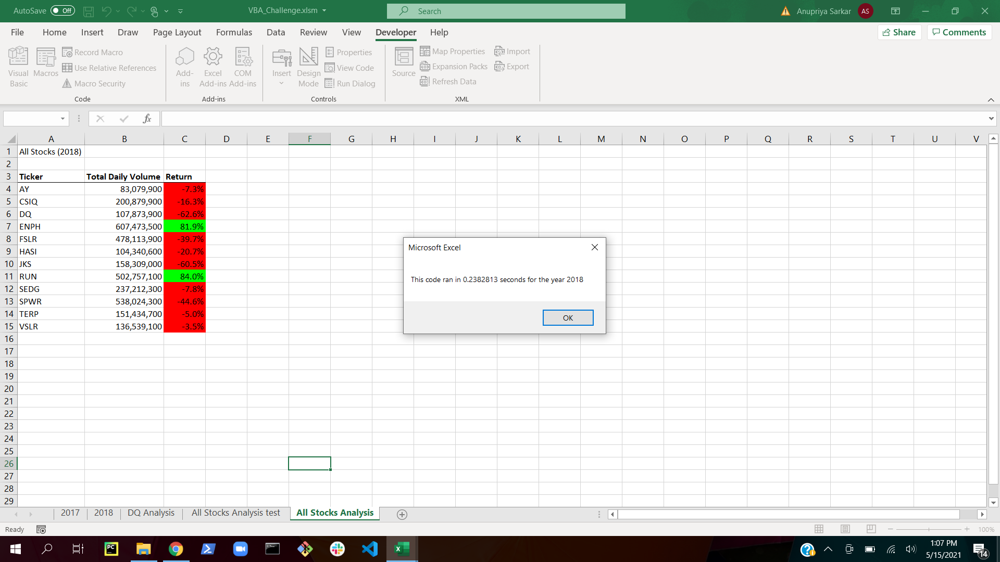
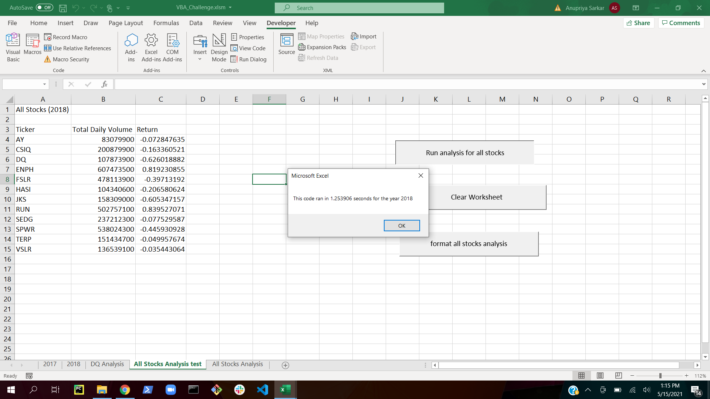

# Stock-Analysis
Weekly Assignment 2 - Analysis of the green energy stocks to help Steve with his investments

## Overview of the Project

### Purpose and Background
In today's world where the alternative sources of energy like hydrothermal energy, solar energy, geothermal energy etc are being extensively used and encouraged, Steve's parents
decide to invest in some of the green energy stocks. We have done a detailed analysis on a handful of the green energy stocks to help Steve to decide where he should invest his
parent's money. Steve's parents were thinking to invest in DAQO New Energy Corporation(DQ) , so we did an analysis on the DQ stocks to check for the returns and total volumes of
stocks invested.We did all our analysis using VBA macros that helps in faster calculations and automate our task. Also using VBA as a tool for analysis the chances of errors reduces
and also the time taken for doing repetetive tasks.

## Analysis of the Project

### Year 2017

1. We calculated the total daily volume for each stock from starting to end of the year 2017. 
2. Also we calculated the return for each stock using their starting price at starting of the year and the ending price at the end of the year. This gave us an idea if that stock
   dropped or rise for that particular year.
3. For doing this we wrote a VBA code and used loops to loop over all the rows for each ticker(stock)value.
4. We used a different worksheet to display our findings for each stock named "All Stocks Analysis test" and "All Stocks Analysis".
5. As we can see from the picture below green stocks for the year 2017 except for the 'TERP' stock that dropped by 7.2%, all other stocks gave a positive return.
6. The DQ stocks for the DAQO New Energy Corporation gave the maximum return with a huge increase of 199.5% .
7. Other stocks like the "SEDG" and "ENPH" stocks also gave a very good return with huge profits.
8. Although the "DQ" stocks gave maximum returns their stocks volume is less as compared to other stocks for the year 2017.
9. During our analysis we used a reafactored VBA code to run the same analysis so that the code can run faster in less time as we can see from the snapshots below.
10. In the refactored code we just looped through all the rows of data and stored the required values in an array of the variables whereas in the original code for each ticker ,
    we looped through all the rows of data which definitely is more time consuming.
	
	The analysis results for the year 2017 for all the green stocks along with the elasped time to run the code is shown below:
	
	For the refactored code:
	
	
	For the original code:
	
	
	The original as well as the refactored script used to perform this analysis is as below:
	
	[Original_script](./Resources/Original_script.vbs)
	[Refactored_script](./Resources/Refactored_script.vbs)
	
### Year 2018

1. For the year 2018 we did the same analysis for all the green stocks.
2. In the excel workbooks the user can just give the year for which they need the analysis outcomes and it will be displayed.
3. For the year 2018 we can see that most of the stocks have dropped down by a significant percentage .
4. The "DQ" stocks that gave the maximum profit for the previous year 2017, has dropped significantly this year by almost 63%.
5. So investing in this stock will not be a wise decision for Steve.
6. The "ENPH" and "RUN" stocks were able to give positive returns for the year 2018 also. So Steve can think of investing in these stocks.
7. Also the "ENPH" stocks have the maximum stocks sold as their daily voulume for the year 2018 is huge.
8. Again for the year 2018 we used our refactored code to do the analysis which took lesser time as compared to the original VBA script.
9. For convinience we also created buttons in our original script so that its easier for Steve to run the required analysis.
10. "ENPH" is a very good stock for investment as it never gave a negative return in the two years and also its profits are comparatively higher.

	The analysis results for the year 2018 for all the green stocks along with the elasped time to run the code is shown below:
	
	For the refactored code:
	
	
	For the original code:
	
	
	The original as well as the refactored script used to perform this analysis is as below:
	
	[Original_script](./Resources/Original_script.vbs)
	[Refactored_script](./Resources/Refactored_script.vbs)
	
## Summary

1. Advantages of refactoring a code is that its more efficient. It takes lesser time for execution, finding bugs in the code is easier and its easier to understand the code.
  Also it may help in reducing redundancy in the code.
  Disadvantages of refactoring a code is that it may take a longer time for a developer to restructure the entire code and may develop new bugs in the process.
  It can also be expensive in preview of the workforce and management.
  
2. Advantages of the original VBA script in this analysis is that its easy to understand the code. Also we used lesser number of varaibles in the original script.
  Disadvantage of the original VBA script is that it takes more time to execute as the loop will be executed as many times as the number of rows multiplied by 12 as 
  there are 12 different tickers. So this definitely increases the execution time.

3. Advantage of the refactored VBA script here is it takes lesser time to execute and is more efficient.Here we are looping as many times as the number of rows which is less
  as comapred to original script.
  Disadvantage is that we need to introduce more variables in the code that incraesed the complexity of the code in terms of understanding. Also it will take up more
  memory space in the computer as here we are storing the values in three different arrays whereas previously we stored these in variables as double data type.
  
  
